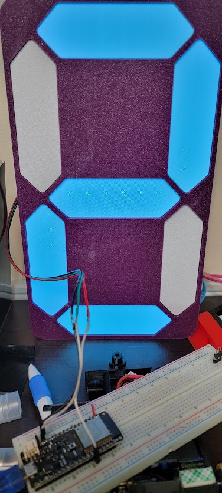
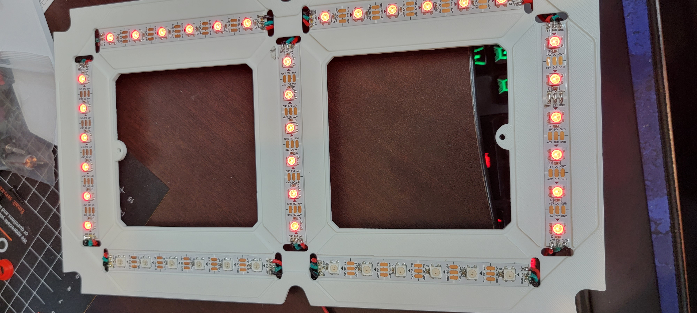
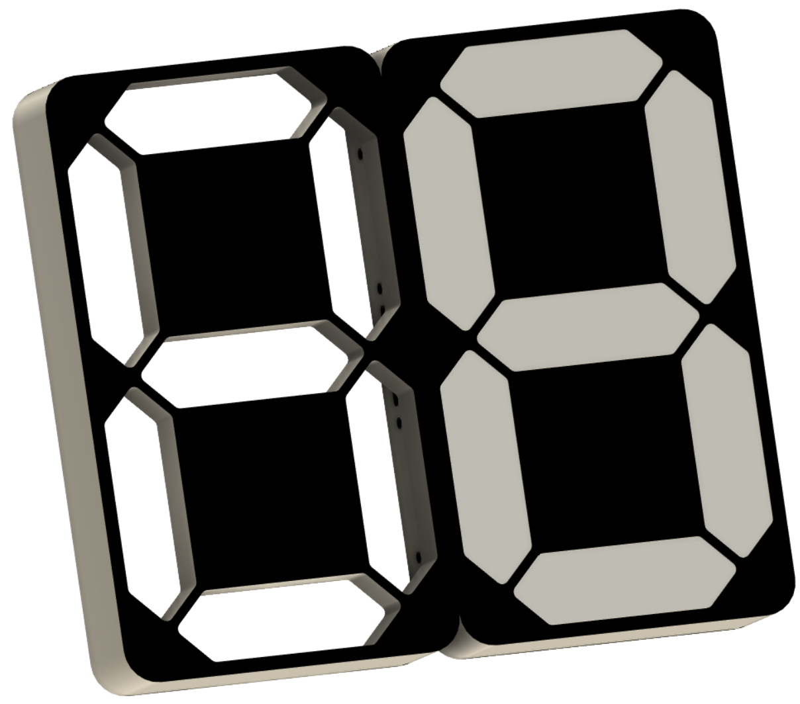

# Countdown Clock intended for Robot Combat Timer
#### Currently under testing, the 3d model printed fine and is usable.
* Digits are 300mm tall, to print you will need a printer that can handle 300mm x 200mm.
* Each segment used 6 leds from a 60 leds/m strip.
* Screw holes that hold down the backplates are designed for a m3 scew up to 10mm (i used m3x8) and a m3 threaded insert.
* Scew holes that hold the seperate digits together are m6x8 or longer.(m6x6 would work in a pinch.)
* programmed using VSCode and PlatformIO, but could easily be copied into the arduino IDE.

## Current functionality  
* can display 0-9 on a single digit
* It gets the time from an NTP server.
* displays the 0s place minute digit on the 7-Segment Display
* colors the 0s place digit with the 10s place minute digit
  
 

# STLs
There is a shell with holes on both sides(for innter digits) and a shell with holes on one side for outer digfits.  
Both shells use the same LED_holder, Cover, and Diffuser.

# Some Images

  
